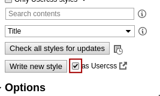
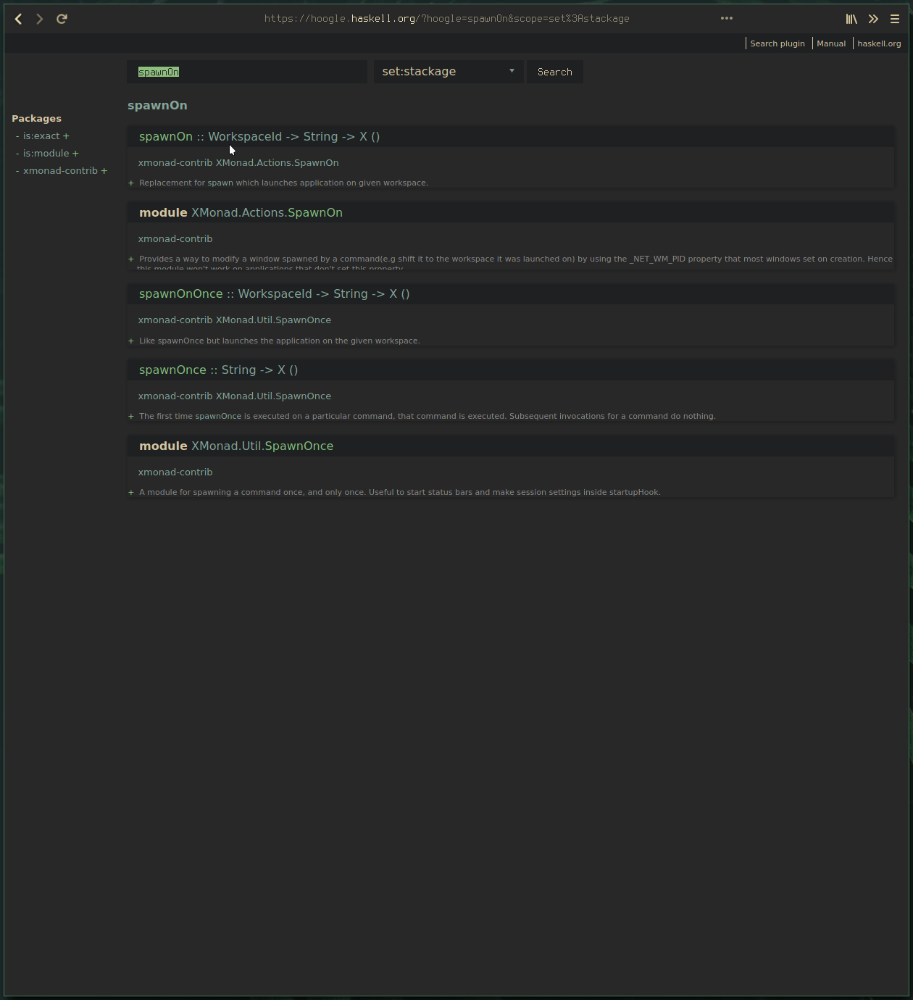
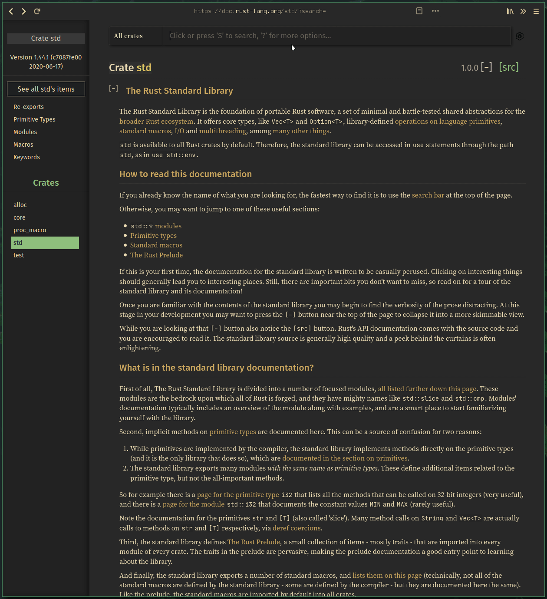
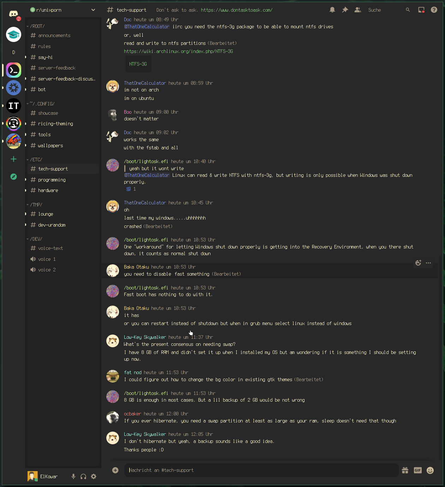

# ElKowar's boxful of gruv

> There are three things in life you can never have enough of: `#282828`, `#ebdbb2` and `#8ec07c`.  
> ~ ElKowar

This is a collection of my gruvbox themes for different webpages and applications.

## Installation

### Prequisites

Some of these themes use special fonts. You'll have to either install them or change the fonts in the respective CSS files.

Fonts used:
- [`Terminus (TTF)`](https://aur.archlinux.org/packages/terminus-font-ttf/)
- [`Jetbrains Mono`](https://www.jetbrains.com/lp/mono/)

### Websites

Most of these themes are just custom CSS for websites.  
You need the `stylus` browser extension (available for chrome and firefox and probably more)
to apply these themes.

After installing the extension, click on the little icon and go to `manage`.
in there, you *enable `as Usercss` and click on "write new style".

Now, select all of the text that is already there, and delete it.
The next step is to paste in the contents of the desired `.styl` file.

If you want to change anything, make sure you set the CSS Linter to "Stylelint", 
as that one will accept the stylus syntax used here.

### Discord

The Discord-theme can be installed using any css-loader of your choice. 
If all you want is to apply this theme, I recommend [beautifuldiscord](https://github.com/leovoel/BeautifulDiscord).
Follow the instructions for your chosen CSS loader, and load in the theme. That's all!

## Showcase

## Contributing

If you find any missing parts (not unlikely, little of this is complete), feel free to submit a PR, fixing the issue.
If your stuff _works_ and is atleast _somewhat_ maintainable, i'll probably merge it if i like it.  
Make sure to describe the thing you're fixing or adding, and to use css variables where appropriate.

> If live gives you lemons, make sure they match `#fabd2f`.  
> ~ Cave Johnson*

_*citation needed_
